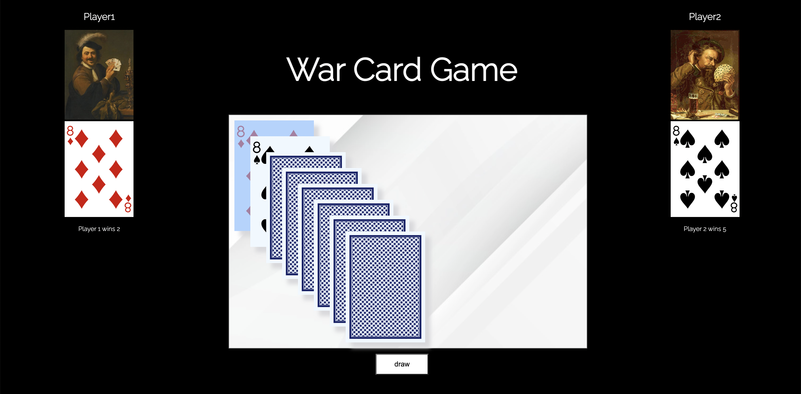

# Game Name: War Card Game

### Description

War is a card game typically played by two players. It uses a standard playing card deck.The objective of the game is to win all of the cards.
For seeing a video for how to play [click here!] (https://youtu.be/J5vT33Vo04s)

### Screen shot

### Technologies used

The project is done using Html, CSS and javascript.

### Getting Started

In the process.

### Next Steps

The project can be more efficient to define two object for player and cards.
